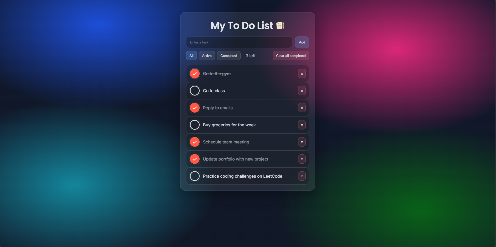

## Todo Application Docs

## Table of Contents

1. [Introduction](#1-introduction)
2. [Demo](#2-demo)
3. [Project Overview](#2-project-overview)
4. [Getting Started](#3-getting-started)
5. [Code Structure](#4-code-structure)
6. [Dependencies](#5-dependencies)
7. [Architecture](#6-architecture)
8. [Usage](#7-usage)

## 1. Introduction

Welcome to the documentation for the Todo Application, a browser-based project built with HTML, CSS, and JavaScript. This project demonstrates state-driven UI rendering, event delegation, and persistent client-side storage without frameworks.

## 2. Demo



## 2. Project Overview

The Todo Application helps users manage tasks in a clean interface. Users can add tasks, toggle completion, delete tasks, filter by status, and clear completed tasks. The app persists data across refreshes using browser storage.

## 3. Getting Started

To run the Todo Application locally, follow these steps.

### Prerequisites

Make sure you have:
- A modern web browser (Chrome, Firefox, Edge, Safari)

### Installation

1. Clone the repository:

```bash
git clone <repository-url>
```

2. Navigate to the project directory:

```bash
cd <project-folder>
```

3. Open `index.html` in a browser.

No additional setup is required.

## 5. Code Structure

The project uses a simple structure for readability and maintainability:

- HTML (`index.html`)
  - App layout and structure
- CSS (`style.css`)
  - Theme, layout, responsive styling
- JavaScript (`script.js`)
  - State management, rendering, events, persistence
- Images (`images/`)
  - UI icons (checked, unchecked, app icon, demo example)

## 6. Dependencies

This project uses no external runtime dependencies.
- No JavaScript frameworks
- No CSS frameworks
- No build tools

## 7. Architecture

### State Model

The application stores todos in an in-memory array. Each todo uses:
- `id`
- `text`
- `done`

The DOM is not the source of truth. The UI renders from the data model.

### Rendering Flow

The render flow stays consistent:
1. Update state
2. Save state to localStorage
3. Re-render the visible list based on the active filter

### Event Handling

The todo list uses event delegation. One list listener handles actions for dynamically created buttons.

### Persistence

Todos persist using `localStorage`:
- Save after add, delete, toggle, clear completed
- Load on startup, then render

## 8. Usage

1. Adding a task
   - Type a task in the input
   - Press Enter or click Add

2. Completing a task
   - Click the checkbox icon to toggle completion

3. Deleting a task
   - Click the delete button or 'x' on a task

4. Filtering tasks
   - Use filter buttons to view All, Active, or Completed tasks

5. Clearing completed tasks
   - Click Clear Completed to remove finished tasks

